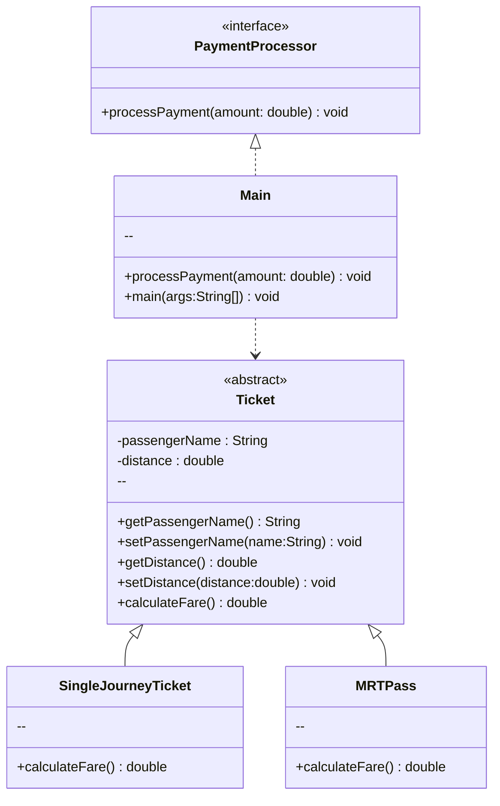

## UML Class Diagram

```mermaid
classDiagram

class PaymentProcessor{
<<interface>>
+processPayment(amount: double) void
}

class Ticket{
<<abstract>>
-passengerName : String
-distance : double
--
+getPassengerName() String
+setPassengerName(name:String) void
+getDistance() double
+setDistance(distance:double) void
+calculateFare() double
}

class SingleJourneyTicket{
--
+calculateFare() double
}

class MRTPass{
--
+calculateFare() double
}

class Main{
--
+processPayment(amount: double) void
+main(args:String[]) void
}

Ticket <|-- SingleJourneyTicket
Ticket <|-- MRTPass
PaymentProcessor <|.. Main
Main ..> Ticket
```
